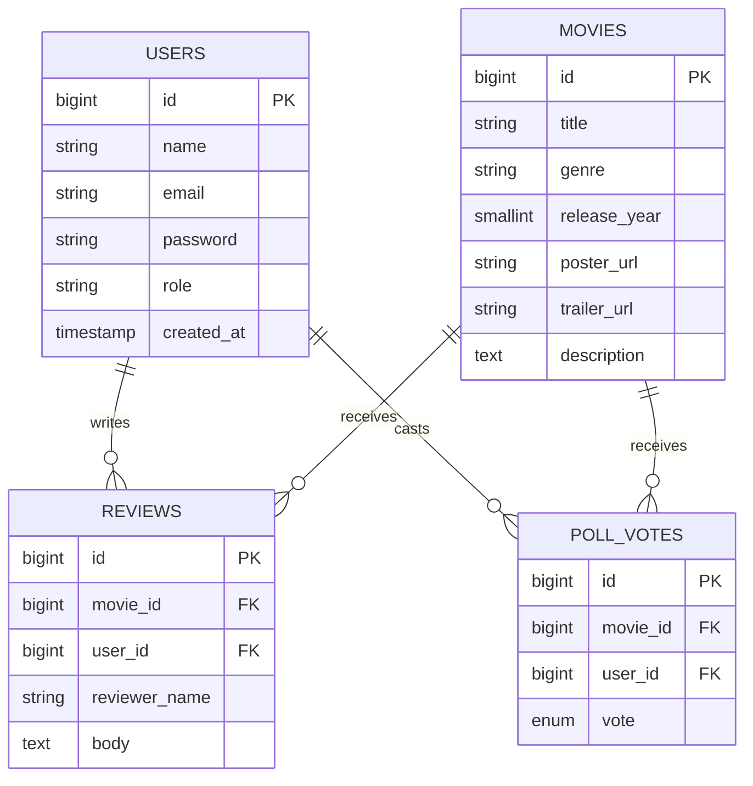
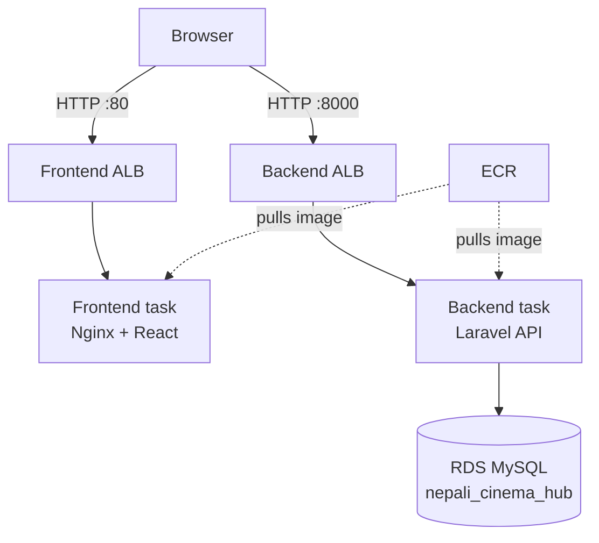

# Cinema Nepal

A community-driven hub for Nepali movies — honest reviews and worth-watching polls, not just ratings.

## Features

- Browse movies currently on cinema and by genre
- Community reviews on each movie
- "Worth watching?" polls (worth / not worth)
- Admin login to manage movie listings

## Tech stack

| Layer | Technology |
|---|---|
| Frontend | React (Vite), served via Nginx |
| Backend | Laravel (PHP 8.2) |
| Database | MySQL 8 |
| Containerization | Docker, multi-stage builds |
| Hosting | AWS (ECS Fargate, RDS, ALB, ECR) |

## Entity-relationship diagram

Core tables: `users`, `movies`, `reviews`, and `poll_votes`. Reviews and poll votes can optionally be tied to a logged-in user (nullable `user_id`), so anonymous submissions are also supported.



## AWS architecture

The app runs as two independently deployed services on **ECS Fargate**, each behind its own **Application Load Balancer (ALB)**, with a managed **RDS MySQL** database for persistence.



### How it works

- **Browser** loads the React app from the frontend ALB, then calls the backend API directly (client-side) through the backend ALB — the two are separate public entry points rather than one unified domain.
- **Frontend ALB** (port 80) is the entry point for the static site. It forwards traffic to whichever frontend task is currently healthy.
- **Backend ALB** (port 8000) is the entry point for the API. Laravel's built-in server (`php artisan serve`) listens on this port inside the container.
- **ECS Fargate** runs both the frontend and backend as serverless containers — no EC2 instances to patch or manage. Each service scales its task count independently.
- **ECR** (Elastic Container Registry) stores the Docker images built locally and pushed via `docker push`. ECS pulls from here on every deployment.
- **RDS MySQL** is a managed database instance, kept in a private security-group boundary — only the backend task's security group is allowed to reach it on port 3306.
- **Security groups** enforce the boundaries: the RDS security group only accepts inbound MySQL traffic from the backend ECS security group, not from the public internet.

### Why two load balancers instead of one

The frontend and backend are deployed as fully separate services with independent scaling, deployments, and health checks. Using two ALBs keeps that separation clean, at the cost of running two load balancers instead of one (the main ongoing AWS cost for this project). A single shared ALB with path-based routing (e.g. `/api/*` → backend, `/*` → frontend) is a common way to reduce this cost if needed later.

## Local development

```bash
git clone https://github.com/suvkshyaa/Cinema-Nepal.git
cd Cinema-Nepal
cp .env.example .env
docker compose up --build
```

- Frontend: http://localhost:5173
- Backend API: http://localhost:8000/api
- MySQL: localhost:3307 (mapped to avoid clashing with local installs)

## Deployment

The production images are built and pushed to ECR manually:

```bash
docker build -t cinema-nepal-backend ./backend
docker tag cinema-nepal-backend:latest <account-id>.dkr.ecr.<region>.amazonaws.com/cinema-nepal-backend:latest
docker push <account-id>.dkr.ecr.<region>.amazonaws.com/cinema-nepal-backend:latest
```

Then force a new ECS deployment to pick up the new image:

```bash
aws ecs update-service --cluster cinema-nepal-cluste --service backend-service --force-new-deployment
```

The same pattern applies to the frontend, with `VITE_API_URL` passed as a build arg pointing at the backend ALB's DNS name.